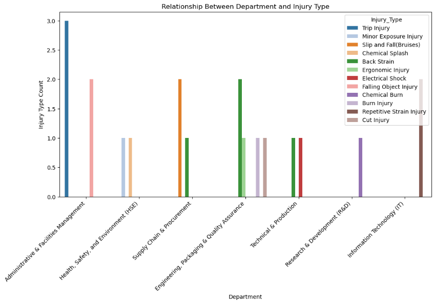
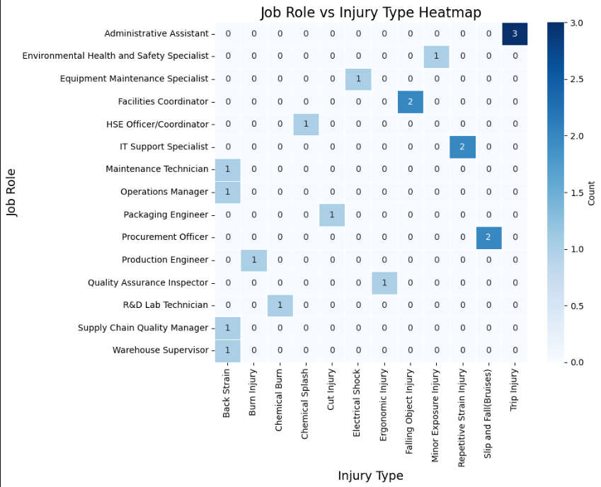
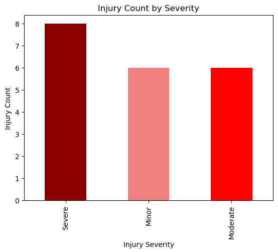
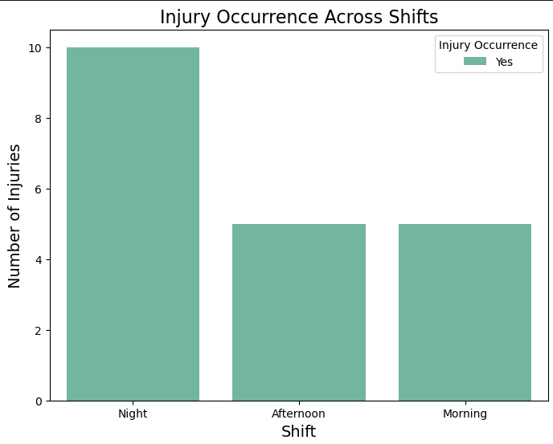
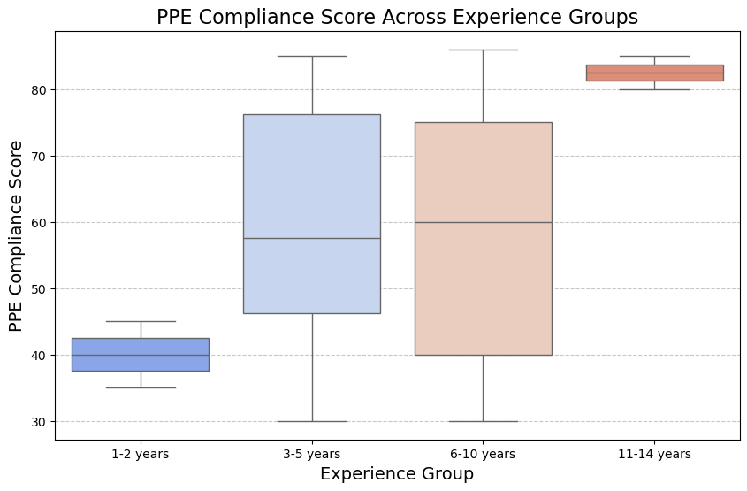

# Uncovering Hidden Patterns in Workplace Injuries at a Food Production Plant
### A Data-Driven Perspective from FGMP

---

## Big Picture

We reviewed **20 injury reports** from the facility over the past **year**. Even though small scrapes and bruises happen often, **8 out of these 20 were serious**. 

Half of all injuries happened at **night**. **Back problems and trips** were the most common.

We also found that folks who **wear their safety gear correctly** and those with **more years on the job** tend to avoid the worst injuries.

---

## 1. Which Teams Get Hurt Most?

- Engineering, Packaging, and Quality teams had **5 injuries**
- Admin and Facilities teams also had **5 injuries**
- Supply Chain had **3 injuries**
- Health, Safety and Environment had **2 injuries**
- Tech and Production had **2 injuries**
- IT had **2 injuries**
- Research and Development had **1 injury**

**Insight:** Both the shop floor and the office need extra safety checks.




---

## 2. Who in Those Teams Gets Hurt?

- Admin Assistants had **3 injuries**
- Procurement Officers, Facilities Coordinators, and IT Support each had **2 injuries**
- Everyone else — from lab techs to warehouse supervisors and engineers — had **1 injury** each

**Insight:** Office workers face the same trip and strain dangers as the people on the line. We need to check desks and pathways just as much as machines.

---

## 3. What Kinds of Injuries Happen?

- **4** back strains
- **3** trips
- **2** slips with bruises
- **2** falling-object injuries
- **2** repetitive-motion strains
- **1** minor chemical exposure
- **1** chemical splash
- **1** posture-related ache
- **1** electric shock
- **1** chemical burn
- **1** regular burn
- **1** cut

**Insight:** Nearly half of the injuries involve backs or trips. Better housekeeping and safe lifting practices could prevent many cases.

---

## 4. How Bad Are the Injuries and When Do They Happen?

- **8** serious injuries
- **6** moderate injuries
- **6** minor injuries
- **10** injuries happened at **night**
- **5** injuries in the **morning**
- **5** injuries in the **afternoon**


**Insight:** Even though nights are quieter, they carry the biggest risk. Simple fixes like brighter lights and extra stretch breaks for night crews could make a big difference.


---

## 5. How We Checked the Findings

We ran basic comparisons to make sure these patterns are real (statistically significant), not random. Key takeaways:

- Serious injuries happen more when people **do not wear their safety gear properly**
- Different teams see **different types of injuries**
- **Job role** affects the kind of injury you might get
- When an injury happens (morning, afternoon, or night) **does not change how bad it is**, even though more injuries happen at night

---

## 6. Safety Gear Use and Experience Matter

When we group employees by how long they’ve worked, the average safety-gear score goes up:

- **1–2 years** on the job — score about **40** out of 100
- **3–5 years** on the job — score about **58**
- **6–10 years** on the job — score about **60**
- **11–14 years** on the job — score about **83**

**Insight:** New hires really need hands-on help learning why and how to wear their safety gear properly.

---

## 7. What We Recommend

1. **Focus on night crews** — brighter lights, short stretch breaks, and extra check-ins to beat fatigue
2. **Office and shop clear-ups** — straighten cords, tidy walkways, and fix chairs to prevent trips and strains
3. **Gear-up drills** — surprise spot-checks and quick hands-on demos to build habits
4. **Buddy system for new hires** — pair new employees with experienced staff to build safe habits fast
5. **Custom safety tips** — short, clear guides for each team based on their top two injury risks

---

##  Methodology

- We reviewed **twenty injury reports** from the last twelve months. (Data collection)
- We counted and grouped injuries by **department, job role, injury type, injury severity, and shift**, then calculated counts and percentages. (Descriptive statistics)
- We checked the shape of **PPE compliance scores** with a **histogram** and tested for **normality using the Shapiro-Wilk test**. (Normality assessment)
- Since the data was **not normally distributed**, we compared PPE compliance scores across injury severity levels using the **Kruskal-Wallis test**. (Non-parametric group comparison)
- After finding a significant Kruskal-Wallis result, we ran **Dunn’s post-hoc tests with Bonferroni adjustment**. (Multiple comparisons)
- We used **Chi-Square tests of independence** to check for relationships between:
  - Department and injury type
  - Job role and injury type
  - Injury severity and shift
  - Department and injury occurrence
- We used **Spearman’s rank correlation** to examine links between:
  - PPE compliance and years of experience
  - Injury severity and years of experience
- We binned **years of experience into four groups** and ran a **Kruskal-Wallis test** to compare PPE compliance across groups.
- All tests were evaluated at a **0.05 significance level** to ensure reliable findings.

---

# Project Overview

This project was developed to uncover patterns behind workplace injuries using **real-world safety data**. It combines **descriptive analysis**, **statistical testing**, and **visual storytelling** to deliver actionable insights for improving workplace safety at FGMP.

---

# Technologies Used

- Python 
- Pandas
- Numpy
- Scipy
- Seaborn
- Matplotlib
- scikit-posthocs

---

# Quick Python Code Sample

```python
from scipy.stats import shapiro

# Check if PPE Compliance Score is normally distributed
stat, p = shapiro(df_copy['PPE_Compliance_Score'])
print(f'Statistic={stat:.3f}, p-value={p:.3f}')
```

👉🏼 Full analysis available in [HSE_analysis2.ipynb](HSE_analysis2.ipynb)
